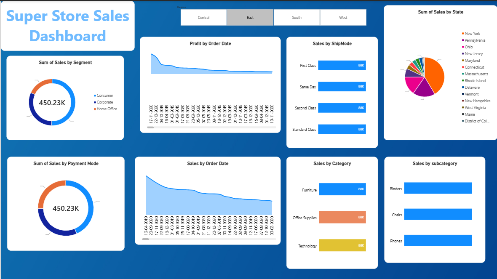
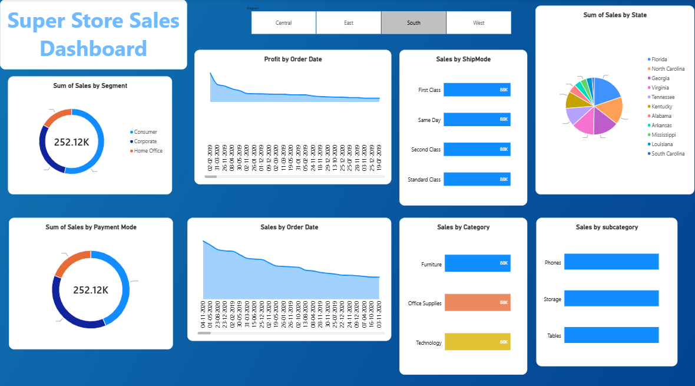
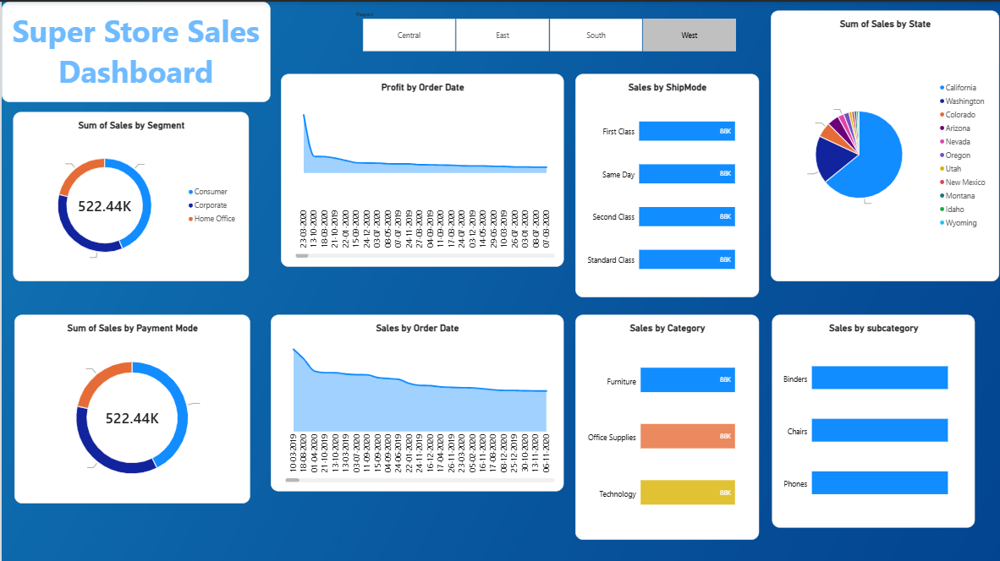

# Superstore Sales Dashboard

Interactive Power BI dashboard analyzing 287 orders across 4 U.S. regions, tracking $88K+ in sales and $15K+ in profit through KPI visuals, trend lines, and category breakdowns.

## Dashboard Views by Region

## Key Findings
- Identified the West region as the top performer, driving 64% of total sales and $13.5K in profit, while the Central region posted a net loss — surfacing a regional profitability gap worth further investigation.
- Broke down revenue by Category, Sub-Category, Payment Mode, Ship Mode, and Segment using bar, donut, pie, and area charts, with a Region slicer enabling interactive drill-down.
- Found Office Supplies (41% of sales) and Phones ($14K, top sub-category) as leading revenue drivers, with Cash on Delivery as the dominant payment mode at 49% of sales.

## Tools Used
Excel, SQL, Power BI
